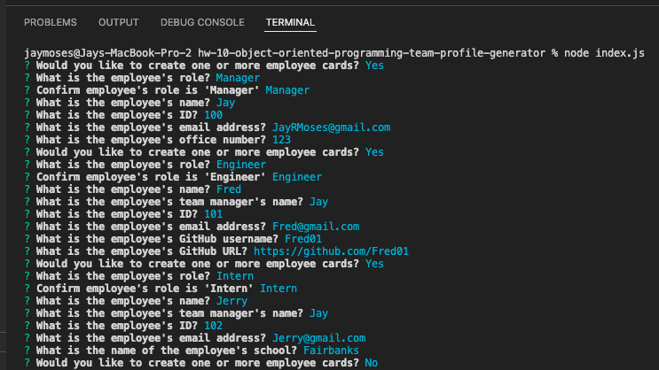
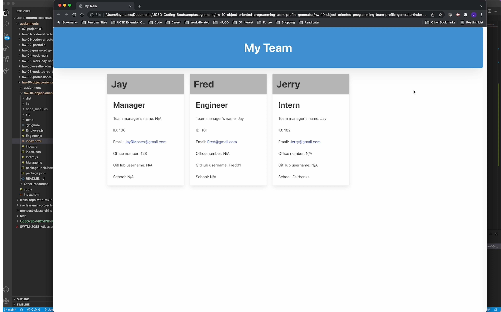

# Homework 10: Team Profile Generator

## Description

I created a Node.js command-line application with this functionality:

* Upon running "node index.js" in the command line, the user is prompted to enter their information as the "Manager", along with the information for their team: "Engineer" and "Intern" roles.
    * The following information is entered for all three roles (Manager, Engineer, and Intern):
        * Team manager's name
        * Employee ID
        * Email address
    * Along with the above fields, certain additional information is requested for the three roles.
        * For the "Manager" role:
            * "Office Number"
        * For the "Engineer" role:
            * GitHub username
            * GitHub URL
        * For the "Intern" role:
            * School
* The user can enter an unlimited number of team members, whose information cards will appear in a generated HTML file that was also designed to be visually appealing. The HTML file is generated upon exiting the prompts.

NOTE: This assignment does not currently include the tests, although they will be added in the near future.

## Screenshots of the application

## Application walkthrough video demo

A video demonstrating the functionality of this application can be found at the URL below.

URL of walkthrough video demo: https://drive.google.com/file/d/1WmZjWhy6yW6lzieqqZTEs-W0v0VjLyMj/view?usp=sharing

## Sample generated README file

A sample generated README file can be viewed in assets > index.html or by clicking here: 

## Technologies used

This application utilizes these technologies:

* Node.js
* JavaScript
* The [Inquirer package](https://www.npmjs.com/package/inquirer)
* HTML
* The Bulma CSS framework

## Contact information

* Website: https://jaymoses01.github.io/hw-08-updated-portfolio-page/
* Email: JayRMoses@gmail.com

## MIT license

Permission is hereby granted, free of charge, to any person obtaining a copy
of this software and associated documentation files (the "Software"), to deal
in the Software without restriction, including without limitation the rights
to use, copy, modify, merge, publish, distribute, sublicense, and/or sell
copies of the Software, and to permit persons to whom the Software is
furnished to do so, subject to the following conditions:

The above copyright notice and this permission notice shall be included in all
copies or substantial portions of the Software.

THE SOFTWARE IS PROVIDED "AS IS", WITHOUT WARRANTY OF ANY KIND, EXPRESS OR
IMPLIED, INCLUDING BUT NOT LIMITED TO THE WARRANTIES OF MERCHANTABILITY,
FITNESS FOR A PARTICULAR PURPOSE AND NONINFRINGEMENT. IN NO EVENT SHALL THE
AUTHORS OR COPYRIGHT HOLDERS BE LIABLE FOR ANY CLAIM, DAMAGES OR OTHER
LIABILITY, WHETHER IN AN ACTION OF CONTRACT, TORT OR OTHERWISE, ARISING FROM,
OUT OF OR IN CONNECTION WITH THE SOFTWARE OR THE USE OR OTHER DEALINGS IN THE
SOFTWARE.
